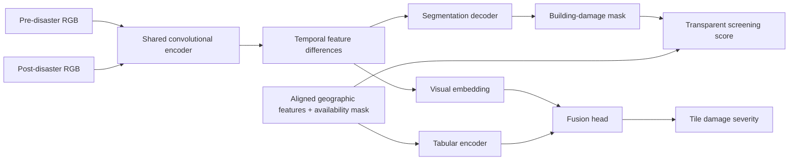

# TerraVision — Multimodal Damage Mapping

TerraVision is a research prototype for **building-damage assessment from pre/post disaster satellite images**. It rasterizes xBD building polygons into five pixel classes, trains a custom **Siamese U-Net** with a shared convolutional encoder and skip-connected decoder, and predicts tile-level damage severity. When aligned population, elevation, access, hospital-distance, and infrastructure features are available, a learned tabular branch fuses them with visual embeddings. A separate, explicitly **unvalidated** screening score helps sort model outputs for human review.

The repository includes an end-to-end synthetic smoke dataset so the software can be run immediately. **Synthetic smoke metrics are not evidence of real-world damage-assessment accuracy.** No real xBD model weights or benchmark scores are bundled.


*Synthetic example generated by this repository; it is not satellite imagery.*

## Architecture



The segmentation decoder predicts background, no damage, minor damage, major damage, and destroyed. A 64-dimensional visual embedding and 32-dimensional tabular embedding feed the fusion head, which predicts the highest labeled building-damage class in a patch. The screening score is computed after inference; it is **not** a learned or validated priority label.

## Quick start

Python 3.10+ is required. PyTorch installation may vary by hardware; see the [official installation guide](https://pytorch.org/get-started/locally/) if `pip install` does not choose the right build.

```bash
python3 -m venv .venv
source .venv/bin/activate
pip install -e .

terravision demo-data --output data/demo --events 6 --pairs-per-event 6
terravision prepare --raw data/demo --features data/demo/features.csv --output data/processed --patch-size 128
terravision train --manifest data/processed/manifest.jsonl --output runs/demo --epochs 2 --batch-size 4 --width 8 --compare-image-only
terravision evaluate --checkpoint runs/demo/multimodal/best.pt --manifest data/processed/manifest.jsonl --split test
terravision rank --checkpoint runs/demo/multimodal/best.pt --manifest data/processed/manifest.jsonl --output runs/demo/review_queue.csv --split test
```

Run prediction on a prepared patch after training. The feature JSON must contain values aligned to that exact image tile; `prediction.json`, `mask.png`, and `overlay.png` appear in the output directory.

```bash
terravision predict \
  --checkpoint runs/demo/multimodal/best.pt \
  --pre data/processed/patches/synthetic-event-00_00000000_x0_y0/pre.png \
  --post data/processed/patches/synthetic-event-00_00000000_x0_y0/post.png \
  --features-json examples/features.json \
  --output runs/demo/prediction
```

## Real xBD data

Download the [xBD/xView2 dataset](https://xview2.org/dataset) under its own terms. The official [xView2 baseline repository](https://github.com/DIUx-xView/xView2_baseline) describes the paired imagery and JSON building labels. Put the extracted `images/` and `labels/` directories side by side, for example:

```text
data/xbd/train/images/hurricane-michael_00000000_pre_disaster.png
data/xbd/train/images/hurricane-michael_00000000_post_disaster.png
data/xbd/train/labels/hurricane-michael_00000000_post_disaster.json
```

Then run:

```bash
terravision prepare --raw data/xbd --output data/xbd-processed --patch-size 256 --features data/xbd-features.csv
terravision train --manifest data/xbd-processed/manifest.jsonl --output runs/xbd --epochs 20 --compare-image-only
```

The optional features CSV must have `image_id` plus any of these numeric columns:

| Column | Unit / meaning |
| --- | --- |
| `population_density` | people per km² |
| `elevation_m` | elevation in meters |
| `road_access` | access index from 0 (inaccessible) to 1 (accessible) |
| `hospital_distance_km` | distance to the nearest hospital in km |
| `critical_infrastructure_count` | number of nearby critical facilities |

`image_id` may identify an entire xBD chip or a specific `..._x{left}_y{top}` patch. Patch rows take precedence. These features must be computed from sources spatially and temporally aligned to each tile; the repository does **not** silently invent real geographic observations. If no features are provided, training automatically uses the image-only model and `--compare-image-only` is unavailable.

## Evaluation and interpretation

The preparation step assigns all patches from the same disaster to one of train, validation, or test. Validation chooses the best checkpoint; test is then evaluated once. `metrics.json` and `comparison.json` record pixel-level IoU/F1 for building-damage classes and tile-severity F1. The optional ablation trains a second model without tabular features using the same split and seed.

The `rank` command writes a CSV sorted by the unvalidated screening score, along with predicted damage share, severity, and feature availability for each prepared tile. It is a review queue, not a field-deployment recommendation.

### Smoke-run results (seed 42, Apple MPS)

The quick-start configuration above ran for two epochs on 36 **synthetic** image pairs from six generated events, with one six-pair event held out for testing. These figures verify the evaluation path only:

| Model | Test damage macro IoU | Test damage macro F1 | Test tile-severity macro F1 |
| --- | ---: | ---: | ---: |
| Multimodal | 0.310 | 0.396 | 0.333 |
| Image-only | 0.299 | 0.389 | 0.333 |

**Real-data results: pending.** The synthetic results are too small and artificial for a resume or a disaster-response claim.

The xBD label task is **building damage**, not flood-water segmentation or road-blockage detection. The current tile-severity target is the highest labeled building-damage class in a patch. It is a coarse proxy, especially when a patch contains only a few damaged pixels. The 0–100 priority score in inference is a transparent heuristic combining predicted damaged-building share with whichever exposure/access features were supplied; it has no response-priority ground truth and must not be treated as an operational decision or a trained ranking result.

For a resume, report only metrics measured on real held-out disasters, include the number of events/chips evaluated, and compare the multimodal severity F1 with the image-only baseline. Do not use the synthetic smoke run as a benchmark.

## Development

```bash
python -m unittest discover -s tests -v
```
